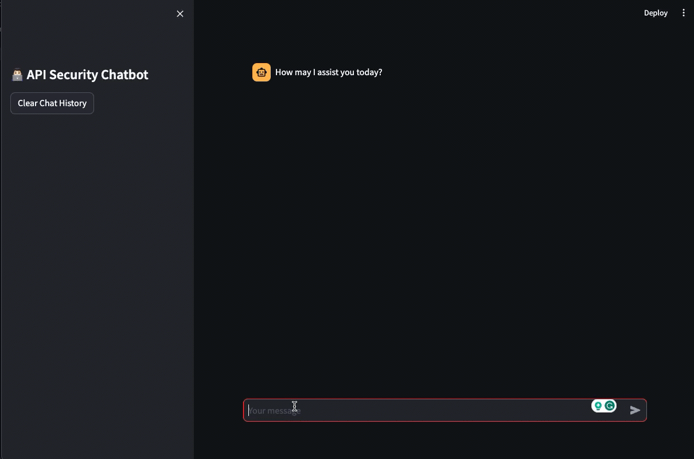

# API Security Chatbot
This is sample Chatbot built for API Security Assistant using Streamlit and LangChain

## How to run this Chatbot?

Install prerequisites

```bash
pip install streamlit langchain
```

Make sure the model is running with Ollama. Run following command to launch the Chatbot 

```bash
streamlit run chatbot.py
```

